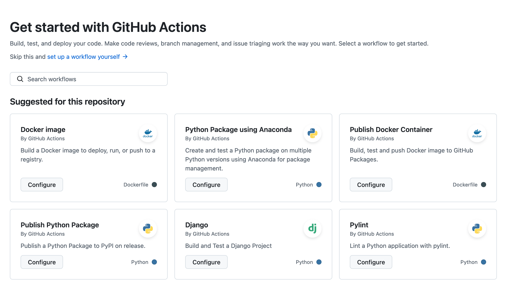

# Creating custom images

After you become comfortable with using manifests to create pods and move around in Kubernetes and containers, you will want more control over the image on which your container is built.  

So far, we have been using images available on [Docker Hub](https://hub.docker.com/), which is the default repository the W&M Kubernetes cluster searches when you go to pull an image.  There are an enormous number of images available on this platform --- essentially any common, conceivable image combination is there.  You need Python 3.11 with Conda and CUDA support? Already exists.  You need a minimal image with only curl installed to test API calls? Already exists.

But in the event we need more, we have options for expanding beyond this set.  Here are two ways to create a *custom* image:

- **Build locally and push to Docker Hub.**  This is the most straightforward way to build an image. However, it does require you to install software on your personal machine, and it is of course not conducive to collaborative projects or replicating results. 

- **Build using Github Actions.**  This method has a little steeper learning curve, but once you have a few working examples it is not intimidating.  It has the benefit of not requiring you to work locally, and of being inherently collaborative through a git-style workflow.


## Example Dockerfile

Regardless of our image creation method, we will create and use a specially formatted file called a `Dockerfile` as the instructions to the builder of how to build the image.  Our Dockerfile will instruct the builder to pull a particular base image, install any additional software, Python environments, and anything else we want.

As the running example for both these methods, we'll use the following very simple instructions:

```Dockerfile
# install a slim Python image
FROM python:3.11-slim

# install the requests package
RUN pip install --no-cache-dir requests

# move a Python script into the image
COPY script.py /app/

# set the working directory
WORKDIR /app

# this forces Python print statements to print to logs
ENV PYTHONUNBUFFERED=1

# run the script
CMD ["python", "script.py"]
```

This pulls a base Python image, installs the `requests` package, pulls a `script.py` script over to the `/app` directory, sets the default working directory there, and runs the script.  For the script, let's pull the most recent event on Github's timeline using their public API, just for fun:

```python
import requests
import json

response = requests.get('https://api.github.com/events')
event = response.json()[0]

print(f'Last event: {event["type"]} | {event["repo"]["name"]}')
```

We chose this as an example because it is simple, demonstrates that Pods are connected to the internet, requires only pulling one additional simple Python package, and shows how to use Python scripts as auto-run from an image with print-statement logging.

We'll refer back to these files in both example ways to build a custom image.


## Option 1: Build a custom image locally

To build an image locally and push to Docker Hub, we will first need:

- **Software on our computer that can build an image.**  I recommend installing [`podman`](https://podman.io/), which is an open-source alternative to Docker.  On Ubuntu Linux, installation is as simple as `sudo apt-get update` followed by `sudo apt-get install -y podman`.  For other OS, check out their [installation guide](https://podman.io/docs/installation).  If you prefer (or already have) `docker`, most of the command-line commands are the same between the two.

- **Docker Hub account.**  Head over to their [sign up page](https://app.docker.com/signup) and get a personal account.  This is where your images will go when you build them, and you will pull them in your manifest with `image: <your-docker-username>/<your-image>:latest`.

As a first test you have both these things operational, let's ensure Podman is logged in to your Docker Hub with

```bash
podman login docker.io
```

which will prompt you for your username and password.

Now, create a folder on your local machine called `test-image` and make a file called `Dockerfile` with the contents from above.  No extension, just "Dockerfile", and yes, podman also uses Dockerfile.

Now in Terminal `cd` into the folder containing this file, and run the commands:

```bash
podman build -t test-image .
podman push docker.io/your-dockerhub-username/test-image:latest
```

**PLEASE NOTE: There is a `.` at the end of the build command, pointing podman to the current folder context to look for a Dockerfile. It's easy to miss!**

Success!  You can check your image is on the Docker Hub container registry by navigating to your username --- your image should be there.


## Option 2: Build using Github Actions

You may have noticed one of the tabs on a Github repository is "Actions".  This is a powerful [suite of tools](https://github.com/marketplace?type=actions) to automate your workflows and gets us toe-deep into the realm of CI/CD (continuous integration/continuous development).  Basically, you can setup an event (like a git commit) to trigger an action --- say, do a Linter code check, or label pull requests, etc.  You have something like 2,000 minutes worth of action "time" on Github's hosted services, per month, which is more than enough.

We'll setup an action that, whenever we update a Dockerfile, builds the image and pushes it to a container registry.  We'll show how to push to the Github Container Registry (ghcr.io), although you can use this workflow to push to Docker Hub just as well.

> *In this section, we'll assume you're fairly proficient working with Github and `git`; specifically, that you know how to clone and work on a repo locally, and use basic commands like `git add`, `git commit`, `git push`, `git status`.  If that isn't true, I recommend familiarizing with git before using this approach to creating images.*

First, create a new test repo in your Github account, called `test-repo`.  

Now create a directory called `project`, and in it create two files: a `Dockerfile` and a script called `script.py`.  So your repo looks like this:

```
/test-repo
  /project
    Dockerfile
    script.py
```

In your Dockerfile, use the simple example from before, and same for `script.py`.  Make sure you push all edits to remote and check everything looks correct on Github before moving to the next step.

Now, we will create a workflow that builds this image whenever we make a change to the `project` directory.  In your `test-repo` repo, click on the **Actions** tab and then the option for Docker Image:



This will initiate a YML file, named by default something like `docker-image.yml`, and put it in an auto-created new folder `.github/workflows` in your repo.  Your repo now looks like this:

```
test-repo/
  .github/workflows/
    docker-image.yml
  project/
    Dockerfile
    script.py
```

Modify the provided boilerplate for this new YML to the following:

`docker-image.yml`
```yml
name: Project Image Build
run-name: Build Project Image
on: 
  push:
    branches:
    - main
    paths:
    - '.github/workflows/docker-image.yml'
    - 'project/**'
    # these path settings ensure this workflow only executes on a push
    # to this YML itself, or any file in the project folder

jobs:
  build_and_push:
    runs-on: ubuntu-latest
    permissions:
      contents: read
      packages: write

    steps:
    - name: Check out the repository
      uses: actions/checkout@v3

    - name: Set up Docker Buildx
      uses: docker/setup-buildx-action@v2

    - name: Log in to GitHub Container Registry
      uses: docker/login-action@v2
      with:
        registry: ghcr.io
        username: ${{ github.actor }}
        password: ${{ secrets.GITHUB_TOKEN }}
        # note: you don't need to setup this token -- GH does it for you

    # this step converts your GH username to lowercase if needed (required for ghcr)
    # and sets the correct environment variable
    - name: Define lowercase repository owner
      id: repo
      run: echo "REPO_OWNER=$(echo ${{ github.repository_owner }} | tr '[:upper:]' '[:lower:]')" >> $GITHUB_ENV

    - name: Build and push Docker image
      uses: docker/build-push-action@v3
      with:
        # this sets the build context to the project folder. It will by default 
        # build from whatever Dockerfile it finds here
        context: ./project   
        push: true
        tags: ghcr.io/${{ env.REPO_OWNER }}/test-project-image:latest
```

Now, commit the changes, and click on Actions again to check on the build's progress.  You can also view the step-by-step logs to debug, by clicking on the workflow run and then on the one job `build_and_push` itself.  Once it's queued, executed, and completed, the action will show a green check icon and you are done! --- Congratulations, your image is now available publicly on `ghcr.io`.


## Testing the image

Now that our image is on a cloud-based container registry, either Docker Hub or GHCR, we want to make sure we can pull it into our Kubernetes cluster.

Here's a simple YAML manifest to pull this image we've just made and create a Pod with it.  Since we know the image runs a Python script, we won't include any `command` arguments as this might override the `CMD` at the end of the Dockerfile.

```yaml
apiVersion: v1
kind: Pod
metadata:
  name: test-pod
spec:
  activeDeadlineSeconds: 1800  # Pod will be terminated after 30 minutes
  containers:
    - name: test-pod-container

      # if you pushed your image to the Docker Hub, use this:
      image: "<docker-username>/<image-name>:latest"
      # (because Docker Hub is the default for CM)

      # if you pushed your image to GHCR, use this:
      image: "ghcr.io/<github-username>/<image-name>:latest"
      
      resources:
        requests:
          memory: "1Gi"
          cpu: "1"
```

Now you can run the usual `kubectl apply` and `kubectl logs` to see the output of the `script.py` script (**note: I have `kubectl` aliased to `k`**):

```bash
[stmorse@cm test]$ k apply -f image-test-pod.yml 
pod/test-pod created
[stmorse@cm test]$ k logs test-pod
Last event: PushEvent | lonelilbot/musixmatch-token
```

and of course your logged last event will be different, this is pulling from the Github live timeline.

Voila!  Now you know how to create a custom image two ways.


## Coda: workflow on K8S vs. Slurm

Either of these methods can result in some pretty awful workflows if you're not thoughtful about how and why you're using Kubernetes to do stuff.  For example, let's say you have a training script that runs a few epochs over a dataset on a mounted drive.  

On Slurm, you'd write a job script to allocate some resources to run this in a pre-configured virtual environment. Presumedly, you'd already debugged the script on a smaller dataset in an interactive environment.  Worse case, you discover some new set of bugs, and have to iteratively modify the Python, re-run the job script.

On Kubernetes, there is a rough correspondence between the Slurm job script and the K8S YML manifest:  both allocate resources and set the job in motion.  A difference however, is that instead of just pre-configuring a virtual environment, we need to pre-configure an entire image, which includes a venv, and which can be a little more involved.  *And*, as we have seen in this post, involves creating at least one new file (the Dockerfile) and possibly two (the Github workflow YML).  

So, although this post showed how to include running a Python script in your image, you will likely want to avoid this for many projects, since you'd be combining image debugging and script debugging in a bad way.
