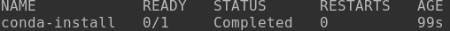

# Setting up Python and Conda in K8S

We have several different options to work with Python on K8S.

- Use an existing off-the-shelf image (from Docker Hub, GHCR) that has the Python version and additional packages needed already installed.  This is the easiest, but also least flexible option.

- Use an off-the-shelf OS + drivers-only base image, and install Python/Conda and all additional dependencies in your persistent volume.  (Note: this will not work for NFS mounted drives.)

- (Related/Hybrid) (Not recommended) Use an off-the-shelf image with Python, and work in a virtual environment on your NFS mounted home drive (for example in `~/.conda/envs`).  Although this will work, it is buggy and could create complicated dependency issues with your SciClone venv.

- Create a custom image that has exactly the base image, Python version, packages, and any other software/drivers you need.  **This is the preferred option** in most cases, and we'll cover in a separate post ("Creating custom images").


## Using an off-the-shelf image with Python

The easiest option in many cases will be to find an existing image on one of the whitelisted image repositories (Docker Hub is the current CM default) that has what you need.  Then just create a pod with this image, attach it to your NFS drive for data/scripts, and off you go.

Here's an example manifest:

`testPythonPod.yml`
```yaml
apiVersion: v1
kind: Pod
metadata:
  name: test-python-pod
spec:
  activeDeadlineSeconds: 1800  # Pod terminates after 30 min
  securityContext:
    runAsUser: 123456
  containers:
    - name: test-py-pod-container
      image: "python:3.11-slim"
      resources:
        requests:
          memory: "1Gi"
          cpu: "1"
      volumeMounts:
      - name: home
        mountPath: "/sciclone/home/stmorse"
      command: ["/bin/sh", "-c", "sleep 1800"]
      stdin: true
      tty: true
  volumes:
  - name: home
    nfs:
      server: 128.239.56.166
      path: /sciclone/home/stmorse
```

Let's create this pod and enter it in interactive mode (`kubectl create -f testPythonPod.yml` and `kubectl exec -it test-python-pod -- /bin/bash`).

Let's check we have Python, where it lives, and which version we have:

```
123456@test-python-pod:/$ which python
/usr/local/bin/python
123456@test-python-pod:/$ python -V
Python 3.11.10
```

Perfect!  Let's check what packages this image with:

```
123456@test-python-pod:/$ pip list
WARNING: The directory '/.cache/pip' or its parent directory is not owned or is not writable by the current user. The cache has been disabled. Check the permissions and owner of that directory. If executing pip with sudo, you should use sudo's -H flag.
Package    Version
---------- -------
pip        24.0
setuptools 65.5.1
wheel      0.44.0
```

Pretty plain.  We can try to install a package, like `pip install requests`, but it will return an error like `ERROR: Could not install packages due to an OSError: [Errno 13] Permission denied: '/.local'`.  You can try including the flag `--no-cache-dir` but you'll get the same error.  Because you don't have root privileges in the container, there is no way to fix this problem.

So, if you can find a Python image that fits the bill (and there are many!  For [`pytorch`](https://hub.docker.com/r/pytorch/pytorch), for [`conda`](https://hub.docker.com/r/conda/miniconda3/), and many others), then you'll need to pursue another option.

Next we'll discuss an option using a PV.  If you don't have a PV or don't wanna, your next option is to create your own custom image.


## Installing Conda in our Persistent Directory

Below is an example manifest that pulls a base NVIDIA/CUDA image, attaches a PVC, and then installs Miniconda in the PVC.  

> **This example is from an older version of this tutorial and may no longer work.**

Most of this is code you've seen before - but there are a few notable differences.  First, we aren't explicitly requesting resources, as we don't really care what we get here - anything from 1 CPU up will work.  Second, we're both loading our base image (the NVIDIA base), and also installing things within that base image - in this case, the `wget` tool using apt-get.  This is because wget doesn't exist on our base image, and we need it to install conda (note we also have to defined a keyserver here - this is because of some unique issues related to the NVIDIA image, and would not be common to all cases). Finally, and most importantly, we download and install conda to the path we specify with an environmental variable.  If this path is on your persistent volume, then it will stay installed between sessions.

> Of note, this particular yaml does not have a sleep command at the end.  Thus, once conda is installed, it will release the resources for the pod back to the cluster.

```yaml
apiVersion: v1
kind: Pod
metadata:
  name: conda-install
spec:
  restartPolicy: Never
  volumes:
    - name: home-volume
      persistentVolumeClaim:
        claimName: dsmillerrunfol-rwm
  containers:
    - name: conda-container
      image: "nvidia/samples:vectoradd-cuda11.2.1"
      volumeMounts:
        - name: home-volume
          mountPath: /kube/home/
      command:
        - /bin/bash
        - -c
        - |
          # Add the NVIDIA GPG key
          apt-key adv --keyserver hkp://keyserver.ubuntu.com:80 --recv-keys A4B469963BF863CC
          apt-get update && apt-get install -y wget --fix-missing

          # Define Miniconda installation path
          MINICONDA_PATH="/kube/home/.envs/conda"

          # Check if Miniconda binary exists
          if [ -f "$MINICONDA_PATH/bin/conda" ]; then
              echo "Miniconda binary found. Checking if it is functional."
              PATH="$MINICONDA_PATH/bin:$PATH"
              if conda --version; then
                  echo "Miniconda is functional. Skipping installation."
                  exit 0
              else
                  echo "Miniconda binary is not functional. Reinstalling."
                  rm -rf "$MINICONDA_PATH"
                  wget https://repo.anaconda.com/miniconda/Miniconda3-latest-Linux-x86_64.sh -O /tmp/miniconda.sh
                  bash /tmp/miniconda.sh -b -p "$MINICONDA_PATH"
                  rm /tmp/miniconda.sh
                  PATH="$MINICONDA_PATH/bin:$PATH"
              fi
          else
              echo "Miniconda binary not found. Installing Miniconda."
              wget https://repo.anaconda.com/miniconda/Miniconda3-latest-Linux-x86_64.sh -O /tmp/miniconda.sh
              bash /tmp/miniconda.sh -b -p "$MINICONDA_PATH"
              rm /tmp/miniconda.sh
              PATH="$MINICONDA_PATH/bin:$PATH"
          fi

          #Confirm Installation
          conda info
```

Go ahead and deploy this yml file via `kubectl apply -f 1_installConda.yml`.  Once complete, it will install conda into your persistent claim to the mounted path /kube/home/.envs/conda .  You can monitor the progress of the conda installation by typing either `kubectl get pods` or `kubectl logs conda-install`.

> Because we do not have a sleep command in this script, when it is done the `kubectl get pods` will show that the pod has completed:


# Exploring persistence with Conda

Now that conda is installed in our persistent directory, we can use it in any pod we want.  You can do this interactively, or through a dedicated pod. We'll cover the dedicated pod approach in the next tutorial, but here we'll show how you can do it interactively.

First, create a simple pod that we can log in to that has our persistent volume attached to it, and adds the conda path to our global path:
```yaml
apiVersion: v1
kind: Pod
metadata:
  name: interactive-conda
spec:
  activeDeadlineSeconds: 1800  # Pod will be terminated after 30 minutes
  restartPolicy: Never
  volumes:
    - name: home-volume
      persistentVolumeClaim:
        claimName: dsmr-vol-01  # Ensure this is your correct PVC
  containers:
    - name: pytorch-setup-container
      image: "nvidia/samples:vectoradd-cuda11.2.1"
      resources:
        requests:
          memory: "16Gi"
        limits:
          memory: "16Gi"
      volumeMounts:
        - name: home-volume
          mountPath: /kube/home/
      command:
        - /bin/bash
        - -c
        - |
          sleep infinity
```
Once that file is created, run `kubectl apply -f interactiveCondaPod.yml` to deploy our pod.  Once it's up and running, hop into an interactive shell with `kubectl exec -it interactive-conda -- /bin/bash` .  In order to use conda interactively, we must first tell the shell where it is located.  To do this, simply type these two lines into your shell.  Note this has to be done any time you open a new shell.
```
export MINICONDA_PATH="/kube/home/.envs/conda"
export PATH="$MINICONDA_PATH/bin:$PATH"
```
After you export these paths, you can now type "conda", and you will now see the usual conda help documentation.  Let's go ahead and create a very simple python environment that has pandas installed:
```
conda create -n pandasEx python==3.10
source activate pandasEx
conda install pandas
```
Note that you will frequently need to use the `source activate` technique in kubernetes pods due to system restrictions on rights, but depending on your image `conda activate` may also sometimes work.  Once you have pandas installed, double check it's working by:
```
python
import pandas
```

Finally, to illustrate persistence, log out of the node and delete it using `kubectl delete pod interactive-conda`.  Now, let's recreate it and confirm conda is still working:
```
kubectl apply -f interactiveCondaPod.yml
kubectl exec -it interactive-conda -- /bin/bash
export MINICONDA_PATH="/kube/home/.envs/conda"
export PATH="$MINICONDA_PATH/bin:$PATH"
source activate pandasEx
python
import pandas
```

If everything worked correctly, pandas should import without any additional installs or information required!
