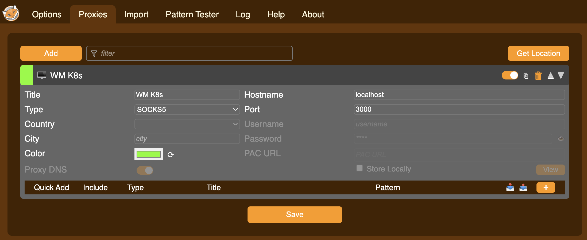
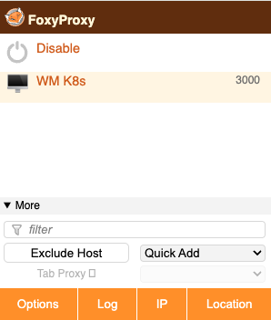

# Hosting a website on the cluster

This is an explanation of how to set up port forwarding so that you can view a website hosted on a pod in a local web browser.
The basic idea is that we will create a SOCKS5 proxy to tunnel into the cluster, then access the website via the pod's internal IP.
This can be useful to, for example: test services running with a pod/deployment, or to access a Jupyter kernel running in a container from a browser on your local machine.

## Correctly exposing the application

Ensure your Docker container is correctly serving your application.
This will likely involve exposing a port in your Dockerfile

```Dockerfile
EXPOSE <INTERNAL-PORT>:<EXPOSED-PORT>
```

and in your Kubernetes manifest.

```YAML
kind: Pod
metadata:
  name: <POD-NAME>
spec:
  containers:
    - ports:
	  - containerPort: <EXPOSED-PORT>
```

## Setting up a nodeport

We can't directly access a pod from outside the cluster, so will need create a nodeport service that we can tunnel through.
Add the following service to your manifest, setting appropriate ports.

```YAML
---
apiVersion: v1
kind: Service
metadata:
  name: <SERVICE-NAME>
spec:
  type: NodePort
  ports:
    - port: <INTERNAL-CLUSTE-PORT> # Set to <EXPOSED-PORT> for simplicity
      targetPort: <EXPOSED-PORT>
      nodePort: <EXTERNAL-PORT>  # Port the SOCKS5 proxy will connect to. Should be in the 30000-32767 range
  selector:
    app: <APP-NAME>
```

## Configuring a SOCKS5 proxy

Now we install a proxy switcher, such as [FoxyProxy](https://chromewebstore.google.com/detail/foxyproxy/gcknhkkoolaabfmlnjonogaaifnjlfnp?hl=en) Chrome extension.
Proxy settings configured in FoxyProxy only affect Chrome, so should not interfere with other traffic on your machine.

1. Configure a SOCKS5 proxy with `HostName: localhost` and `Port: 3000`, or any other port you would like to use.
   
2. Click Save.
3. Activate the proxy from the Chrome menubar. At this point Chrome should lose internet access, as the proxy configuration is not connected to a proxy server.
   

## Accessing the cluster

Log into the cluster with the following command.
We want to jump through the bora frontend as usual, but this time must also set a dynamic forwarding port, which will be the port specified in the proxy configuration.

```zsh
ssh -J <USERNAME>@bora.sciclone.wm.edu -D 3000 <USERNAME>@cm.geo.sciclone.wm.edu
```

(**Note:** This will not work off campus without the school's [vpn](https://www.wm.edu/offices/it/services/network/vpn/).)

To simplify this command (and logging into the cluster generally), add the following to your `ssh-config`.

```ssh-config
Host wm-bastion
	HostName bastion.wm.edu
	User <USERNAME>

Host bora
	HostName bora.sciclone.wm.edu
	User <USERNAME>
	ProxyJump wm-bastion

Host wm-k8s
	HostHame cm.geo.sciclone.wm.edu
	User <USERNAME>
	ProxyJump bora
	DynamicForward <EXTERNAL-PORT> # Only set if you want every ssh session to port forward.
```

With this config, run

```zsh
ssh wm-k8s
```

or alternatively

```zsh
ssh wm-k8s -D <EXTERNAL-PORT>
```

if you do not want to set automatic dynamic forwarding.

Once logged in, the tunnel should be active!
Note that you will need to keep the ssh session running in order to maintain the tunnel.

## Displaying the webpage

Once logged in, find the IP of the pod hosting your website using

```tcsh
kubectl get pods -o wide
```

to see all pod IPs or

```tcsh
kubectl get pod <POD-NAME> -o jsonpath="{.status.podIP}"
```

with the name of your pod.

Access this address in Chrome at the exposed port, `http://<POD-IP>:<EXTERNAL-PORT>`. You should see your site.
