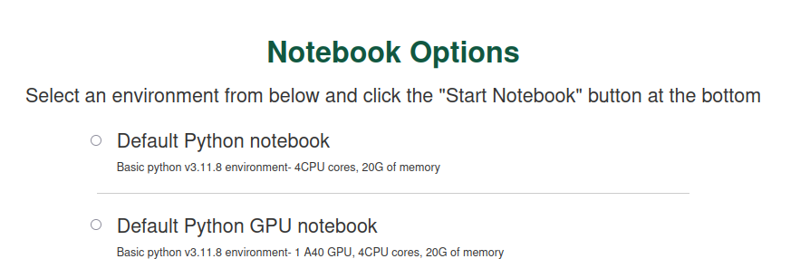
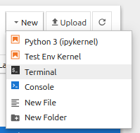
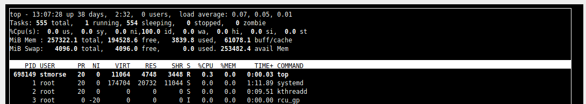

# Using Jupyter on the HPC

Jupyter notebooks are a popular choice for interactive exploratory work in many disciplines including data science.  (Its name is a reference to the three core programming languages supported -- Julia, Python, and R -- although Python is the most common usage.)  We have several options for using Jupyter notebooks on the HPC:

- **Using [`notebooks.sciclone.wm.edu`](https://notebooks.sciclone.wm.edu/).**  This is the easiest method, provides multiple high performance and GPU-enabled kernel environments with pre-loaded packages, with zero setup.  Basically you go to the website, pick an environment from a list, it opens a Jupyter notebook, and off you go.  It is also the least flexible, since you are required to work from the browser and do not have granular control over your system resources or Python environment.

- **Port tunneling into a node.**  This is slightly more involved, but a better choice if you need detailed control over your allocated resources, or a more bespoke Python environment.  Here, you create your Python environment, allocate a job (Torque/Slurm), initiate a Jupyter kernel from within that job, and then (on your local machine) *port tunnel* your browser into that node/job.

(*Side note:* We can even port tunnel from an IDE, like VS Code, into an interactive job, but this is more difficult and we'll put in a post on IDEs.)

We'll cover both methods, then do a short section on running tests to make sure they worked and how to monitor resources on the HPC from within Jupyter.

## Using `notebooks.sciclone.wm.edu`

Navigate to [notebooks.sciclone.wm.edu](https://notebooks.sciclone.wm.edu/).  You will see a screen something like this:



As you can see, this JupyterHub launch page gives you a bunch of different pre-fab notebook + Python environment options --- GPU support, PyTorch, etc.  Go ahead and select a notebook with GPU support (for example, I currently have "Data Science GPU notebook" as an option) and click "Start Notebook".

We'll check the notebook has the resources and packages we want at the end of this post.  

## Port tunneling

If you are unsatisfied with the control over resources and/or packages the JupyterHub option provides, you can instead directly hook a Jupyter notebook on your local machine's browser to an IPython kernel running on a node in an interactive job.  The steps to do this are:

1. Initiate an interactive job with the resources you want.  See [this post](../../the-batch-system/interactive-jobs.md) for more detail, or check out the examples on the [HPC website](https://www.wm.edu/offices/it/services/researchcomputing/using/running_job).

2. (If needed) Create the Conda environment you want.  See [this post](../conda-environments.md) for more detail.  Make sure your Conda environment has Jupyter --- while in your activated environment, run `conda install jupyter`.  It doesn't matter if you create this environment from within the job or not.

3. In the interactive job, and within the activated environment, start a headless Jupyter notebook with `jupyter notebook --no-browser --ip=\*`.  This will start an IPython kernel on the node, and expose a port that you can access, but without opening a browser.  It should even give you a URL pre-formatted with this access point and an authentication token.

So far our terminal looks something like this:

    ```bash
    [bora] salloc -N 1 -n 4 -t 1:00:00 --gpus=1
    salloc: Granted job allocation 12345
    salloc: Nodes bo01 are ready for job

    [bo01] module load anaconda3/2023.09
    [bo01] conda activate my-env
    (my-env) [vo03] jupyter notebook --no-browser --ip=\*
    [C 11:38:56.480 NotebookApp] ...

    Copy/paste this URL into your browser when you
    connect for the first time, to login with a token:
    http://localhost:8888/?token=39ff...26fe
    ```

4. Leave this kernel running.  We will now forward this port (8888) on the bora subcluster to our local port 8888.  This is called port tunneling, since it's like our connected ports create a tunnel of information flow from remote to local.  To do this, in a new terminal session on your local computer, run

    ```bash
    ssh -NL 8888:bo01:8888 user@bora.sciclone.wm.edu
    ```

You can always learn more about SSH commands on the [man](https://linuxcommand.org/lc3_man_pages/ssh1.html) page, but in short this new `-L` flag binds `local_socket:host:hostport` on the remote machine specified.  The `-N` flag tells SSH not to execute any additional commands, since we're just doing a port forward.

5. Open a browser and copy-paste the URL for the Jupyter kernel.  (Alternatively, manually type `localhost:8888` and then manually authenticate if necessary.)  A Jupyter landing page will open up to your home directory on SciClone.

## Running tests

Once you have a notebook running, let's run a test to make sure we actually have the resources and packages we think we do.  Let's just do the simple:

    ```python
    import torch
    torch.cuda_is_available()
    ```

and you should see `True`.

We can also check out what resources are available to us, and monitor status, from within the Jupyter environment, by starting a Terminal tab.



Now try something like `top` and you will see


