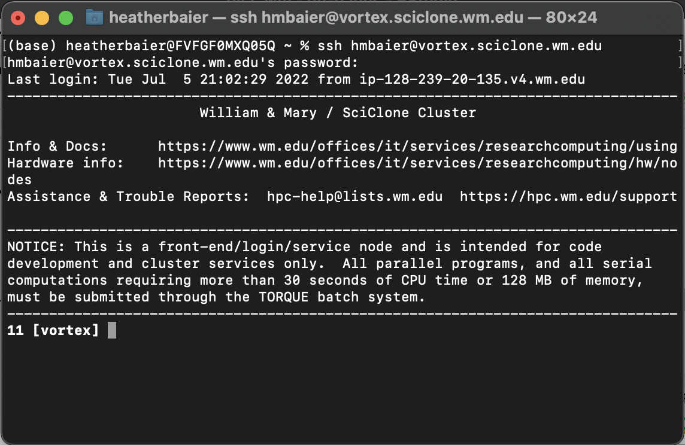

# 👋 Login & Basic Setup

Now that you have an account, let's get familiar with the SciClone cluster.

## Logging In

Open a terminal and type:

```ssh
ssh [wm_username]@[subcluster_name].sciclone.wm.edu
```

For this example, we'll be logging into the Vortex sub-cluster, so type `vortex` in place of `[subcluster_name]`. When prompted for a password, enter your W&M password.

Your terminal should now look similar to this:



**Fun sidenote:** you may notice that "SciClone" kinda sounds like "cyclone".  Presumably inspired by this hilarious pun, the HPC has used a "wind" theme to name most of the subclusters: Vortex, Gust, ... --- even [Bora](https://en.wikipedia.org/wiki/Bora_(wind)) is a wind reference: it's from the Greek name for the katabatic winds in the north Adriatic!  The more you know!

## Home Directory

Type `pwd` (print working directory) into your terminal. It should print out: `/sciclone/home20/<wm_username>` or `/sciclone/home/<wm_username>`.

This is your landing, or "home" directory - you'll open to this every time you login.

Now type `ls` into your terminal. If this is the first time you are logging in, you should see 4 folders print out. You can find read more about the purpose of each of these folders [here](https://www.wm.edu/offices/it/services/researchcomputing/using/files/index.php).

**Note on symlinks.** Your home directory is the same across all subclusters in SciClone -- it is the same filesystem, connected across via [symlinks](https://en.wikipedia.org/wiki/Symbolic_link).  Try saving a test file in your home directory while logged into `vortex` --- now exit vortex and log into `bora`: you will see the same file structure, and same file.  (This is an important note when we begin talking about virtual environments, or persistence in containerized workflows.)

## Working Directories

You are free to make as many folders here (in home20) as you like, as long as you _do not_ store large amounts of data in them.

Best practice is to store code files within your home directory, but (large) **data** within a dedicated lab folder --- for example, in Dan Runfola's geoLab we use either `/sciclone/geograd/` or `/sciclone/geounder/`.

You can make a new folder using the `mkdir <folder_name>` command.  Make sure to familiarize yourself with other command line operations for file systems: `rm` (remove), `mv` (move), `cp` (copy), etc.  Each has idiosyncrasies and unique flags for specific details, **and each is (generally speaking) non-reversible**.  Once you `rm` a file (or files!), there is no "Recycle Bin" to retrieve it!
