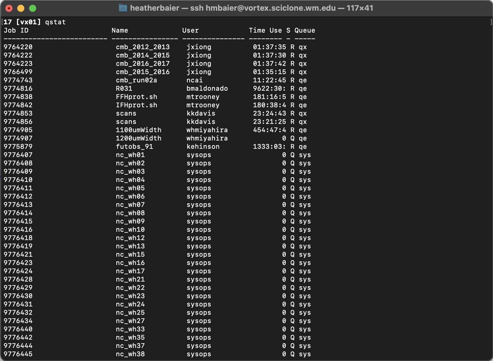
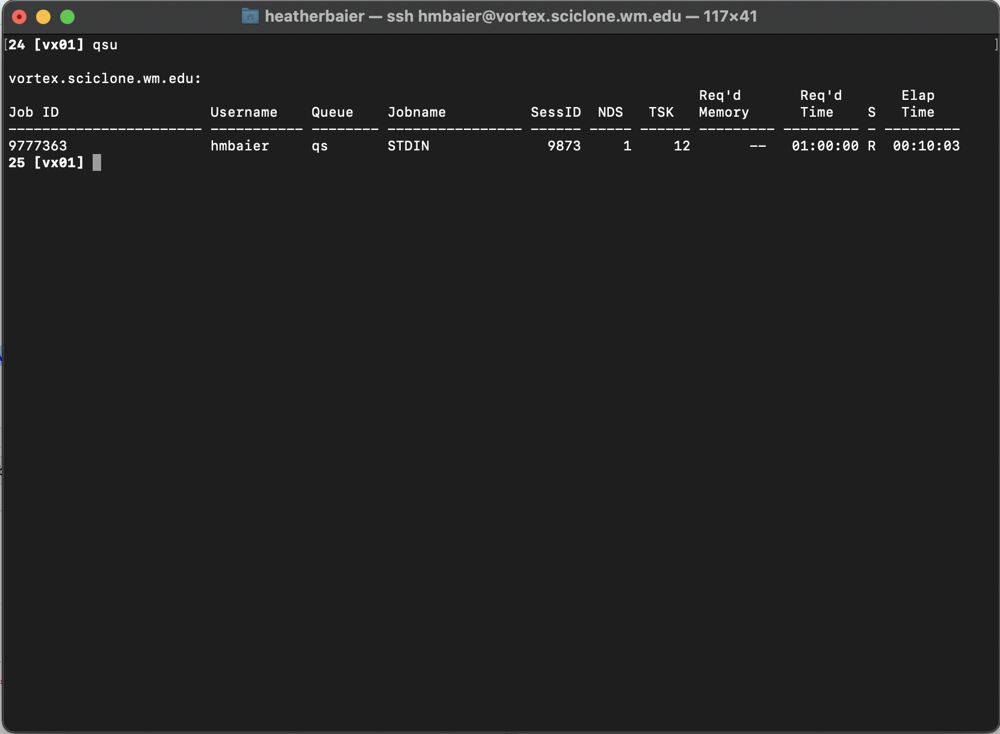
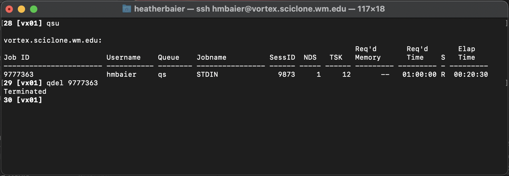
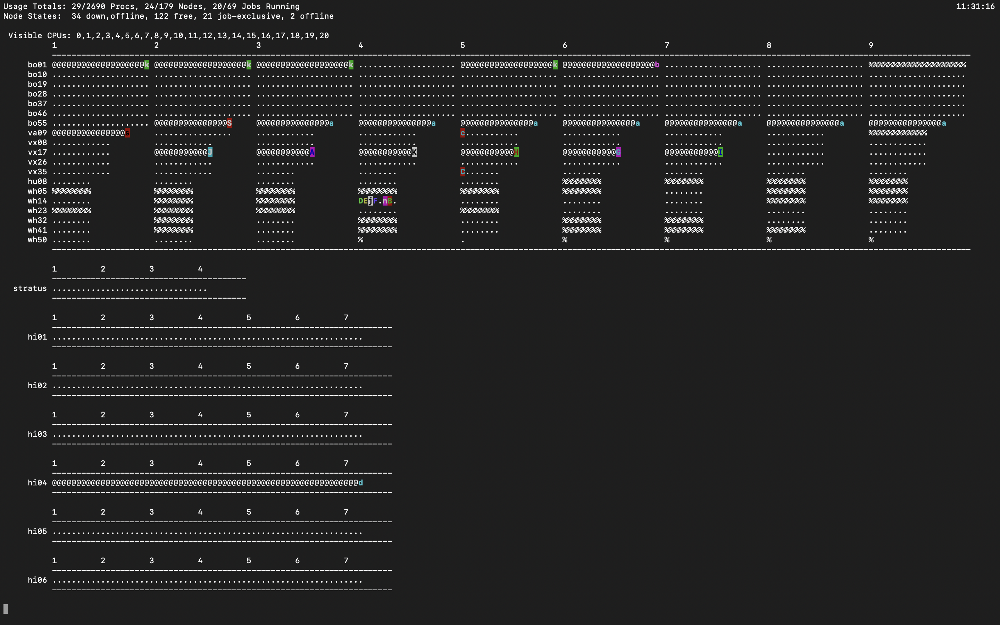

# Checking the status of your jobs

So you've launched a job, yay! 

Let's look at some ways to look at the status of your job, check activity across the cluster, and delete a job.  

## Slurm: `squeue`

Running `squeue` (think: Slurm queue) from your terminal on a front-end will give you a table of statistics about all of the jobs currently running on that sub-cluster.  The output will look like:

```bash
12 [bora] squeue
             JOBID PARTITION     NAME     USER ST       TIME  NODES NODELIST(REASON)
              4114     batch    run_2 pmcardle  R   21:17:52      2 bo[30-31]
              4113     batch    run_2 pmcardle  R   21:18:01      2 bo[28-29]
              4112     batch    run_2 pmcardle  R   21:18:16      2 bo[26-27]
              4111     batch    run_2 pmcardle  R   21:18:27      2 bo[02-03]
              4133     batch 80_nf5.5  ychuang  R    7:13:43      1 bo01
              4141     batch      ccc xliang06  R    3:49:10     20 bo[05-08,10-25]
              4137      hima 78_n9E5_  ychuang  R    6:44:10      1 hi01
              4136      hima 78_n9E5_  ychuang  R    6:47:10      1 hi01
              4135      hima 78_n9E5_  ychuang  R    6:54:52      1 hi01
              4134      hima 78_n9E5_  ychuang  R    6:59:18      1 hi01
```

You can also limit this to just jobs under a particular username (like your own username, or someone else) with the `-u` flag,

```bash
13 [bora] squeue -u pmcardle
             JOBID PARTITION     NAME     USER ST       TIME  NODES NODELIST(REASON)
              4114     batch    run_2 pmcardle  R   21:21:29      2 bo[30-31]
              4113     batch    run_2 pmcardle  R   21:21:38      2 bo[28-29]
              4112     batch    run_2 pmcardle  R   21:21:53      2 bo[26-27]
              4111     batch    run_2 pmcardle  R   21:22:04      2 bo[02-03]

```

This command lists:

- **Job ID:** The unique ID given to our job

- **Name:** The name of the job

- **User:** The username who launched the job

- **Time:** Time elapsed on the job

- **Nodes / Nodelist:** Number of nodes reserved and their number

### Slurm: Deleting a job

You may want to delete a job before its walltime limit.  Find the job ID (using `squeue`) and run `scancel [JOB ID]`.  You should see `Terminated` whcih indicates the job has been successfully deleted.

## Torque: `qstat`

For good measure, let's cover the equivalents on Torque.  Running `qstat` from your terminal will give you a table with statistics about all of the jobs currently running on the sub-cluster you are logged into. The output of this command will look like:



To limit this to a particular username, we can again use the `-u` flag `qstat -u [USERNAME]`.  Or equivalently, the HPC has prepopulated all users' `.bashrc` file with the alias `qsu` for `qstat -u`, so you can just do



What does this table tell us?

> **Job ID:** The unique ID given to our job
>
> **Username:** The user who launched the job
>
> **NDS:** Number of nodes reserved
>
> **TSK:** Number of total processors reserved
>
> **Req'd Time:** Amount of walltime requested
>
> **Elap Time:** How long the job has been running for. If the job is in the queue and waiting to be launched, this line will look like `-----------`&#x20;

### Torque: Deleting Jobs

If for any reason you decide that you want to cancel a job before it has reach it's walltime limit, find the job ID (using either of the two methods in the previous page) and run `qdel [JOB ID]`



You should see `Terminated`, which indicates that the job has been successfully deleted.

### PBSTOP

Torque also had a utility called PBSTOP (a modification of the base TOP command) that gave a very nice overview of activity on the cluster.  We're not aware of an equivalent yet on Slurm, but for historical reference this is what PBSTOP output looked like:


