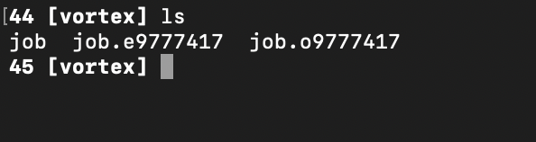
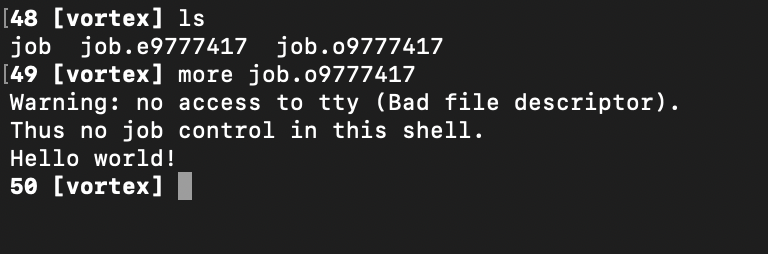

# Non-Interactive Jobs

An interactive job allows you to *interact* with the compute node -- for example, on the command line, via a Jupyter notebook, etc.  They are useful for cases where we're in short, iterative loops of development like exploring data or beginning to write a script for something.  However, they are not conducive to running jobs that take a long time --- you would need to either keep the terminal/notebook open, or use something like tmux, but still you are tying up a command line for no reason. 

A *non*-interactive job is designed for running long, resource-intensive work that you don't need to interact with or monitor.  As a result, they will end up being the more common way you use the HPC.  

Non-interactive jobs are similar to interactive ones in that we request resources from the cluster, then run a series of commands, scripts, etc on the compute node the resource manager gives us.   But they are different in that we do this via a *batch job script*, which we submit and then let run.

We'll cover how to do this in Slurm.  We also include the analogous approach for Torque at the bottom of this post as an archive.

## Slurm

A batch job script is just a text file (often with a `.sh` extension although this is not necessary) that looks something like:

```bash
#!/bin/tcsh
#SBATCH --job-name=serial 
#SBATCH -N 1 -n1
#SBATCH -t 0:30:00

echo "Hello!"
```

That first line starting with `#!` (called a "shebang", or which many pronounce as "pound bang") tells the shell which program to run the script with, in this case, the `tcsh` shell.  

The following lines are directives to Slurm:  the name of the job, the number of nodes and cores, the walltime.  This all mirrors what we did with interactive jobs via `salloc`.

After the `#SBATCH` directives (btw in Torque these are just replaced with nearly identical `#PBS` directives), we put whatever commands we want to run on our `tcsh` shell this script is now running in.

There are more examples of this on the [HPC's "Running Jobs with Slurm"](https://www.wm.edu/offices/it/services/researchcomputing/using/running_jobs_slurm/) page.

### Testing one out

Lets test this script out.  Go to a test folder in your SciClone home, and create a new script file:

```bash
touch test-job.sh
```

Then open with your favorite command line text editor (for example `nano`) and copy-paste the 5 lines from above, save and exit.

Now we can run this script:

```bash
$ sbatch test-job.sh
Submitted batch job 3304
```

After a second, try `ls` again and you will see a new file in your folder called `slurm-3304.out` where the `3304` will match your batch job number.  If you have any errors, those will show up as a separate file with similar numbering scheme.

Check the contents of this file with `more` or `cat`, and you'll see the result of our `echo` command:

```bash
$ cat slurm-3304.out
Hello!
```

That's it!  Now we just need to scale this idea up:  instead of 1 core, let's request several and a GPU, and instead of just an echo command, let's load Conda, activate a virtual environment, and run a script.

That's all you need to run non-interactive scripts in Slurm.  

For archival purposes, here's the equivalent pattern for doing this in Torque:


## Torque (Archive)

In Torque, a job script is just a text file that might look like the following:

```bash
#!/bin/tcsh
#PBS -N demojob
#PBS -l nodes=1:vortex:ppn=12
#PBS -l walltime=00:30:00

echo "Hello world!"
```

We have the same list of arguments in this file that we had in our interactive job, except now we've given it a name using the -N argument.

### Example

First login in to Vortex and make sure you are in your home20 directory using the `pwd` command.

Next, make a folder called demo and navigate into it using the commands:

```bash
mkdir demo
cd demo
```

Once you're in your demo directory, make a new file called job.

```bash
touch job
```

Now, open your new job file in an editor in your terminal by running:

```bash
nano job
```

Within the nano editor, paste the code from above:

```bash
!/bin/tcsh
#PBS -N demojob
#PBS -l nodes=1:vortex:ppn=12
#PBS -l walltime=00:30:00

echo "Hello world!"
```

To exit the nano editor, use the following commands:

`ctrl + x`

`y`

`enter`

Now, type `qsub job` into your terminal. This will submit the job to the job queue. A string of digits (most likely starting with 9) will printout into your terminal. This is your job ID and means that the job has been successfully submitted!

After a couple seconds, type `ls` into your terminal. If you only see your job script, wait a few seconds longer and check again until you see two files that look similar to:



The two new files are your job output files. They will have the naming convention `[JOBFILENAME].e[JOBID]` and `[JOBFILENAME].o[JOBID]`. The file with a .e contains a printout of any errors that caused your job to fail. In this case, the file should be empty. Check that it is by running `more job.e9777417.`If nothing prints out, then your job ran successfully!

Next, check the job output file by running `more job.o9777417`



Ignore the Warning line and the line that starts with 'Thus'. The bottom line should say "Hello World!" thanks to our echo statement in the job script we submitted!
